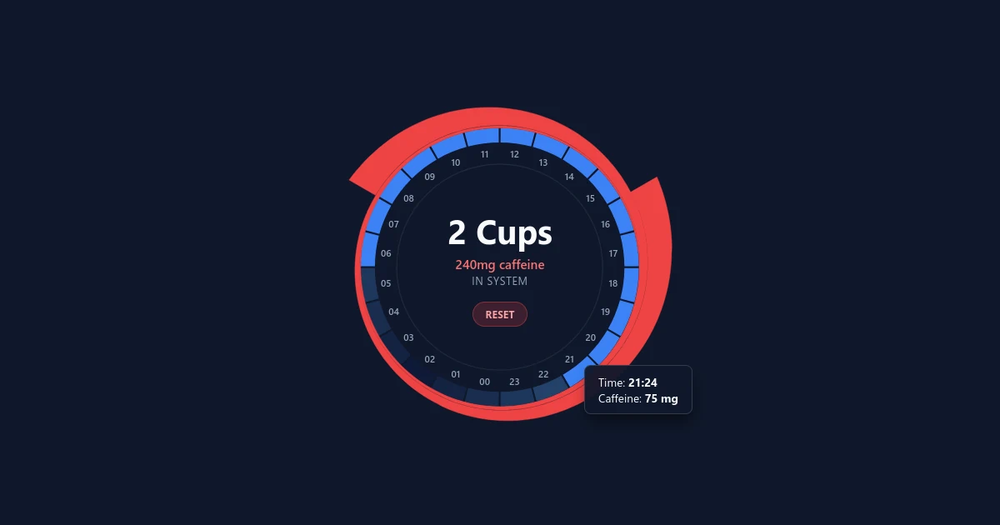

# Caffeine Tracker

**A simple, circular 24-hour visualization tool to track caffeine consumption and metabolization.**

 

## ✨ Features

- **Interactive 24-Hour Dial:** Click on any hour segment to add a cup of coffee, see amount of caffeine—quick, easy and informative.
- **Half-life Math:** Calculates physical caffeine decay down to the minute based on a standard 4.5-hour half-life and an everyday Finnish 2dl coffee cup with 120mg of caffeine.
- **Customizable Variables:** Mainly drink tea or espresso? Know your CYP1A2 genotype? Click the info button on the bottom and enter your own numbers.
- **Privacy-First:** Coffee enjoyment data is processed client-side and never saved. Cookie used to save settings for 7 days, but only if defaults changed. Website uses counter.dev to count visitors anonymously.

## Built With

- **HTML5 / CSS3:** Clean, valid web standards.
- **Vanilla JavaScript:** Quick, no heavy frameworks or dependencies.
- **Dynamic SVG Geometry:** Responsive visualization generated directly via the DOM.

## Setup

No setup needed. Open [index.html](https://jnaskali.github.io/caffeine-tracker/) in your web browser or copy the code to wherever.

## Usage Notes

In healthy adults, caffeine is broken down almost entirely by the liver enzyme CYP1A2 with a typical plasma elimination half-life of 2.5 – 5 hours, but individual variation is huge: smokers clear it almost twice as fast, and metabolism is slowed, for example, in people with obesity or liver cirrhosis and users of oral contraceptives.<a href="#ref1">¹</a>. I decided to not include smokers in the default calculations, and went with an average half-time of 4.5 hours. Users can go down to ~2-3h, if they smoke and/or know they carry genes that increase the functioning of CYP1A2.

Caffeine concentration also varies; for example, an espresso can hold ~75mg, cold brew ~190mg, a large drip-coffee mug ~220mg and a Starbucks Venti ~400mg.

Tweak your values accordingly.

## License
This project is licensed under the MIT License - see the [LICENSE](LICENSE) file for details.

## References

<small>¹ Grzegorzewski, J., Bartsch, F., Köller, A., &amp; König, M. (2022). Pharmacokinetics of caffeine: a systematic analysis of reported data for application in metabolic phenotyping and liver function testing. <a href="https://www.frontiersin.org/journals/pharmacology/articles/10.3389/fphar.2021.752826/full" target="_blank" rel="noopener">Frontiers in pharmacology, 12, 752826.</a></small>